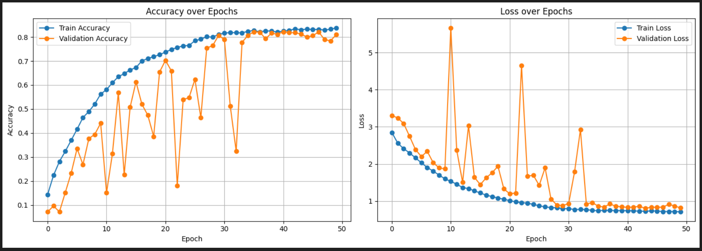

# Stock Pattern Recognition using CNN

## 📌 Overview
This project leverages Convolutional Neural Networks (CNNs) to automatically recognize and classify 14 different candlestick and chart patterns from stock market data. It is aimed at helping analysts or algorithms detect meaningful patterns that may indicate bullish or bearish trends.

---

## 📚 Related Work & Research
Traditional technical analysis is heavily reliant on human interpretation, which often introduces bias and inconsistency. Several recent research works have attempted to apply deep learning techniques to automate this process:

- **DeepCandle (IEEE, 2020):** Introduced a CNN-based model to recognize a limited number (5) of candlestick patterns. The model lacks robustness due to the absence of augmentation, class balancing, and ignores the contextual influence of volume and trend. Reported accuracy was ~72%.

- **CNN-LSTM Hybrid (Elsevier, 2021):** Focused on stock price forecasting using a hybrid of convolutional and recurrent layers. While useful for forecasting, it does not address multi-class pattern classification in images, limiting its scope.

- **arXiv:2201.XXXX – Pattern Recognition in Financial Charts (2022):** Focused on 6 basic candlestick patterns using simple CNNs. Dataset was small and imbalanced, with moderate results (~70%). No validation checks for pattern formation.

- **Financial Chart Pattern Recognition using Deep Learning (IEEE Access, 2023):** Employed a basic CNN architecture to classify chart patterns such as head and shoulders and triangles, achieving around 75% accuracy on unbalanced datasets.

### 🚀 What Makes This Project Unique?
- **Higher Accuracy:** Achieves ~85% accuracy across 14 well-distributed pattern classes through architecture tuning and robust preprocessing.
- **Pattern Diversity:** Recognizes both candlestick and chart patterns, unlike many works which focus on one type.
- **Volume & Confidence Checks:** Integrates additional checks during dataset creation to improve label reliability.
- **Balanced Dataset:** Uses class balancing and augmentation to avoid overfitting and class bias.
- **Realistic Dataset Generation:** Patterns are validated with sliding windows and market volume, simulating real-time trading environments.

---

## 🧠 Patterns Recognized
**Candlestick Patterns:**
- Hammer
- Inverted Hammer
- Hanging Man
- Shooting Star
- Morning Star
- Evening Star
- Bullish Engulfing
- Bearish Engulfing

**Chart Patterns:**
- Head and Shoulders
- Double Top
- Double Bottom
- Cup and Handle
- Ascending Triangle
- Descending Triangle
- Falling Wedge
- Rising Wedge

(Note: The final dataset includes a balanced set of 14 classes selected from the above patterns.)

---

## 🗃️ Dataset
- **Images per Class:** 500
- **Total Samples:** 7,000
- **Preprocessing:**  Normalization
- **Augmentation:** Rotation, zoom, horizontal flip, width/height shift
- **Format:** Images stored in separate folders per class
- **Windowing:** Random sliding window technique for unbiased sample extraction
- **Pattern Validation:** Confidence scoring and volume checks included

---

## 🏗️ Model Architecture
- 5 Convolutional Blocks with increasing filters (32 to 512)
- Batch Normalization & ReLU activations
- MaxPooling and Dropout layers after each block
- Global Average Pooling (GAP)
- Dense layer with 128 units and dropout
- Final softmax output layer with 14 units

**Regularization:**
- L2 Regularization (0.00025)
- Label Smoothing (0.1)

**Training Setup:**
- Optimizer: Adam (lr=0.0001)
- Loss: Categorical Crossentropy
- Metrics: Accuracy
- Callbacks: EarlyStopping, ReduceLROnPlateau

<p align="center">
  
</p>
---

## 🧪 Results
- **Final Accuracy:** ~85%
- **Validation Strategy:** 80-20 train-validation split
- **Model Selection:** Early stopping based on validation loss
- **Confusion Matrix:** Available in `results/`

**Performance Comparison:**
| Model/Study | No. of Classes | Accuracy | Dataset Size | Notes |
|-------------|----------------|----------|--------------|-------|
| DeepCandle (2020) | 5 | ~72% | 1500 | Limited patterns, no volume context |
| CNN-LSTM (2021) | 4 | ~78% | 1200 | Hybrid model, time-series heavy |
| arXiv-2022 | 6 | ~70% | 2000 | No augmentation or balancing |
| IEEE Access 2023 | 7 | ~75% | 3500 | Weak validation, limited augmentations |
| **This Work** | 14 | **~85%** | **7000** | Balanced, augmented, validated |

---

## 🔍 Examples
<p align="center">
  
</p>

---

## 🚀 How to Run

### 1. Clone Repository
```bash
git clone https://github.com/hakerpapplu/Stock-Pattern-Recognition-.git
```


---

## 🌱 Future Scope & Extensions
- **Real-Time Pattern Detection:** Integrate the model with streaming stock APIs (e.g., Alpha Vantage, Yahoo Finance) for real-time analysis.
- **Model Deployment:** Host the model using Flask/FastAPI or streamlit for interactive prediction.
- **Multi-Modal Input:** Combine price charts with sentiment analysis or news feeds to enhance prediction context.
- **Time-Aware CNNs:** Explore Temporal CNNs or hybrid CNN-LSTM architectures for improved sequential pattern recognition.
- **Transfer Learning:** Use pretrained visual models (like EfficientNet) for pattern recognition with fewer training epochs.
- **Explainability:** Add tools like Grad-CAM or SHAP to visualize what the model learns from the patterns.
- **Auto-Trade Suggestions:** Link model predictions with a rule-based system to generate buy/sell signals.

---

## 📃 License
This project is licensed under the [MIT License](LICENSE).

---

## 🙋‍♂️ Author
**Tanmay Panchariya**  
2nd Year B.Tech (AI & ML) Student  
Feel free to reach out for collaborations or questions!

